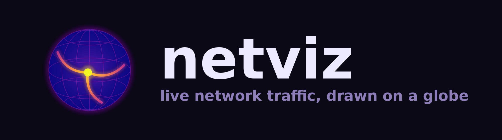
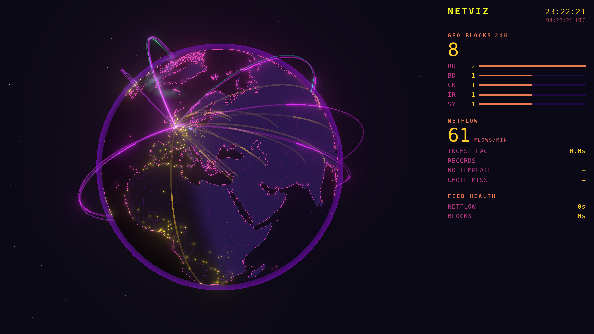

<p align="center">
  
</p>

<p align="center">
  <em>A wall-display globe that draws your network's live traffic as arcs.</em>
</p>

<p align="center">
  <sub>Python 3.12+ &nbsp;·&nbsp; three.js r185 &nbsp;·&nbsp; no bundler &nbsp;·&nbsp; no npm at runtime &nbsp;·&nbsp; no interaction</sub>
</p>

<p align="center">
  
</p>

<p align="center">
  <sub>Synthetic traffic, so every arc above is fake. The rail on the right is optional.</sub>
</p>

<p align="center">
  <b><a href="https://github.com/pyro262/netviz/wiki/Quick-Start">Quick start</a></b> &nbsp;·&nbsp;
  <b><a href="https://github.com/pyro262/netviz/wiki/Configuration">Configuration</a></b> &nbsp;·&nbsp;
  <b><a href="https://github.com/pyro262/netviz/wiki/Troubleshooting">Troubleshooting</a></b> &nbsp;·&nbsp;
  <b><a href="https://github.com/pyro262/netviz/wiki/FAQ">FAQ</a></b>
</p>

---

Point a router's netflow export and syslog at it. It geolocates each flow, streams
the result to a browser over a WebSocket, and renders a three.js globe: ambient
arcs for ordinary traffic, brighter ones for firewall blocks, real stars overhead
turned by sidereal time, and an aurora sized by the live NOAA K-index.

It is built to be left running on a screen nobody touches — there is no UI, no
interaction, and no controls.

**Try it with no router, no database and no credentials:**

```bash
python3 -m pip install -e .
python3 -m netviz.main --synthetic
# open http://localhost:8099/
```

Synthetic mode generates plausible fake traffic, so the whole display works
before anything is wired up.

---

## How it fits together

```
router ──IPFIX/netflow 2055/udp──┐
                                 ├──> netviz-collector ──┬── WebSocket :8099 ──> browser
router ──syslog        514/udp───┘    (geolocate, fan out)└── InfluxDB (optional history)
```

One Python process, one port. `:8099` serves both the page and the WebSocket, so
there is no second container and no separate web server. The browser never holds
database credentials and never talks to the router.

- **IPFIX listener** decodes netflow v10 records (RFC 7011), caching templates
  per observation domain, into `flow` events.
- **Syslog listener** parses netfilter LOG-target lines (`SRC=`/`DST=`/`PROTO=`)
  into `block` events.
- **Enricher** turns addresses into coordinates against a local GeoIP database
  — a memory-mapped file lookup, no network calls, nothing leaves your machine.
  Either MaxMind GeoLite2-City or DB-IP City Lite; it opens whichever is in
  `data/`.
- **Fanout** broadcasts to every connected browser. A client that falls behind is
  disconnected rather than shown a growing backlog.
- **Store** batches events to InfluxDB with a bounded on-disk buffer, so an
  outage does not lose the window. Entirely optional — leave `INFLUX_TOKEN`
  empty and it never runs.

New browsers get a short replay of recent history on connect, so the globe has
arcs on it immediately rather than filling in over the next minute.

## Requirements

- Python 3.12+
- A router that exports IPFIX/netflow v10 and syslog (built against a UniFi
  Dream Machine SE; anything speaking those two protocols should work)
- A GeoIP database in `data/` — `tools/fetch_dbip.sh` downloads one with no
  account needed, see setup step 2
- Optionally Docker, and optionally InfluxDB 2.x for history

## Setup

Everything site-specific lives in files git ignores, so a fork stays safe to push.

| File | Tracked | Contents |
|---|---|---|
| `.env` | no | secrets and your location — copy `.env.example` |
| `docker-compose.override.yml` | no | bind mounts, external networks — copy the `.example` |
| `netviz/static/js/config.js` | **yes** | display settings; safe to commit, holds nothing private |

1. **Configure.**
   ```bash
   cp .env.example .env && chmod 600 .env
   ```
   Set `NETVIZ_HOME_LAT` / `NETVIZ_HOME_LON` to where the arcs should converge. A
   city centre is precise enough — this value ends up on screen, so there is no
   reason to put your street on it.

2. **Add a GeoIP database.** Without one the collector cannot place an address
   and the globe draws nothing, so this is not optional.

   ```bash
   ./tools/fetch_dbip.sh
   ```

   That is the no-account path: it fetches, verifies and installs
   [DB-IP City Lite](https://db-ip.com/db/download/ip-to-city-lite), which
   needs no signup, no key and no `.env`. Re-run it monthly; DB-IP publishes
   one build per calendar month.

   If you would rather use MaxMind GeoLite2 — which is the better database, see
   below — make a [free account](https://www.maxmind.com/en/geolite2/signup),
   put `MAXMIND_ACCOUNT_ID` and `MAXMIND_LICENSE_KEY` in `.env`, and run
   `./tools/refresh_geoip.sh`. Both scripts verify the download before it
   replaces the live file and keep the previous copy as `.prev`.

   The collector opens `data/GeoLite2-City.mmdb` if it is there and falls back
   to `data/dbip-city-lite.mmdb` if it is not, logging which one it chose. Set
   `NETVIZ_MMDB` to override.

   **Which to use.** DB-IP always answers, which is what makes it a good
   default — a first run has arcs on it. MaxMind is more honest: it holds no
   location for anycast ranges like `1.1.1.1` and `8.8.8.8`, so netviz counts
   those as misses and draws nothing rather than drawing a guess. DB-IP places
   `1.1.1.1` in Sydney and `8.8.8.8` at Google's headquarters, which is where
   the addresses are *registered*, not where the servers answering you are. If
   you care that the arcs are true, use MaxMind; if you want it working in one
   command, use DB-IP.

3. **Create the state directory.** The container runs as UID 10001:
   ```bash
   mkdir -p state && sudo chown 10001 state
   ```
   Skip this and the disk buffer silently never persists.

4. **Run it.**
   ```bash
   docker compose up -d --build
   ```
   Then open `http://<host>:8099/`.

   Right-click (or press `s`, or double-tap on touch) for the on-screen menu
   and turn on **Stats rail** for the sidebar — 24h geo-block counts and
   their top countries, flows/min, ingest lag, feed health, a per-rule colour
   panel and a clock. It is off by default because it takes 26% of the
   screen from the globe, and it is a per-display choice remembered in that
   browser's `localStorage`, not a build-wide setting — one collector can
   drive one wall with it and another without. Set `rail.enabled: true` in
   `netviz/static/js/config.js` if every display at your site should default
   to having it.

5. **Point your router at it.** Netflow/IPFIX v10 to `<host>:2055`, syslog to
   `<host>:514`, and turn on logging for the firewall rules you want to see.

6. **Optional: make the display boot into it.** `deploy/kiosk/` has a systemd
   unit and launcher that put a Linux box straight into the globe fullscreen,
   with no login, and bring it back on its own after a power cut. See
   [`deploy/kiosk/README.md`](deploy/kiosk/README.md).

### Two router settings that matter

- **Turn sampling off (1:1).** The decoder reads no sampling-interval field, so
  with sampling on every arc's byte count is wrong by the sampling factor and
  nothing in the code knows. Sampling also drops whole short flows.
- **Make sure your syslog filter actually includes firewall logs.** Many routers
  default to categories that exclude them. The symptom is thousands of flow
  events and zero blocks.

Block arcs also need per-rule logging enabled on the rules themselves.

## Configuring the display

Everything visual lives in **`netviz/static/js/config.js`** — one commented file,
no build step. Edit it and reload; a kiosk reloads itself within ~30s of a
changed file on its own.

Every key is optional. Delete one and the built-in default is used.

| Section | What it controls |
|---|---|
| `traffic` | how many flow arcs per second are drawn; whether DNS is dropped |
| `highlight` | up to three networks drawn in their own colours, matched by address prefix |
| `arcs` | per-class life, thickness, colour, height, glow |
| `camera` | the return/hold/walk cycle, and the block-burst detour |
| `layers` | turn any layer off: stars, aurora, borders, ripples, atmosphere… |
| `appearance` | background colour, bloom strength and rolloff |
| `rail` | site default for the stats sidebar, toggled per display from the menu |
| `polling` | how often health, build, stats and sun state refresh |

Three worth knowing about:

- **`traffic.flowsPerSecond`** (default 14). Arcs blend additively, so drawing
  every event on a busy network sums into a wash that hides the globe. Blocks are
  never sampled — they are the point of the display. Raise it if your network is
  quiet; lower it if the globe disappears behind its own traffic.
- **`highlight.networks`** (default: three empty slots). Up to three of your own
  networks, each drawn in its own colour — a server VLAN, an IoT segment, a
  guest network. **Set the prefixes in `.env`**, not in `config.js`: an address
  prefix describes how your LAN is laid out, and `config.js` is tracked by git.
  ```
  NETVIZ_HIGHLIGHT1_PREFIX=10.10.10.
  NETVIZ_HIGHLIGHT1_LABEL=servers
  NETVIZ_HIGHLIGHT1_COLOR=#a855f7
  ```
  Keep the trailing dot — `10.0.5` would also claim `10.0.50.x`. The collector
  serves these to the page at `/config.json`. An empty slot is simply off.
- **`traffic.dropDns`** (default on). Nameserver traffic is typically 20–30% of
  events and a few percent of the bytes, and anycast resolvers have no city
  record, so it all lands on one country-centroid point. It is dropped from the
  *display* only — the collector still records it.
- **`highlight`** (default off). Give it an address prefix — a server VLAN, an
  IoT segment — and that traffic draws in cyan, deliberately off the plasma ramp
  so it reads as a separate system at a glance. Keep the trailing dot.

## Environment variables

Read in `netviz/config.py`. `INFLUX_TOKEN` is the only secret.

| Variable | Default | Purpose |
|---|---|---|
| `NETVIZ_HOME_LAT` | `30.3` | Where arcs converge |
| `NETVIZ_HOME_LON` | `-97.7` | |
| `NETVIZ_IPFIX_PORT` | `2055` | UDP port for netflow records |
| `NETVIZ_SYSLOG_PORT` | `5514` | UDP port for syslog lines |
| `NETVIZ_WS_PORT` | `8099` | Serves the page and the WebSocket |
| `NETVIZ_MMDB` | `/data/GeoLite2-City.mmdb` | GeoLite2-City database |
| `NETVIZ_BUFFER` | `/state/buffer.jsonl` | On-disk buffer for pending writes |
| `NETVIZ_TEMPLATES` | `/state/templates.json` | IPFIX templates, so a restart loses nothing |
| `NETVIZ_FLUSH_SECONDS` | `10` | How often points are batched out |
| `NETVIZ_LOG_UNPARSED` | `0` | Log this many rejected syslog lines, for writing a parser |
| `NETVIZ_XT_GEOIP_DIR` | `/data/xt_geoip` | Router geo tables, if fetched; absent is fine |
| `NETVIZ_UPDATE_REPO` | `pyro262/netviz` | Release check — **set empty to disable**, see below |
| `INFLUX_URL` | `http://influxdb:8086` | Leave `INFLUX_TOKEN` empty to disable history |
| `INFLUX_ORG` / `INFLUX_BUCKET` | `home` / `netviz` | |
| `INFLUX_TOKEN` | `""` | Secret |

### The update check

The collector asks GitHub once an hour whether there is a newer release
than the one it is running, and the kiosk shows a dim, slowly pulsing
`UPDATE AVAILABLE` in the lower left when there is. **This is on by default.**

It is one unauthenticated `GET` to `api.github.com`. It sends nothing about your
network, your traffic or your configuration — only the standard request a public
release page receives. Nothing is reported anywhere, and the collector makes no
other outbound connection except the NOAA aurora feed.

To turn it off completely, so the request is never made:

```
NETVIZ_UPDATE_REPO=
```

It defaults to on rather than off because the people most likely to be running a
stale build are the ones who never read this file.

`WATCHTOWER_ENV` (read by `notify.py`) points at a file holding a Discord webhook
in shoutrrr form, for stale-feed alerts. Bind it in
`docker-compose.override.yml`; it is read at call time and never copied into the
repo. Leave it unmounted and alerting stays off.

## When something is wrong

`/health.json` reports per-feed staleness. The page polls it and, if the
collector is unreachable or a feed has gone quiet, shows an amber banner and
drains the globe to grey — so a dead feed looks obviously dead from across a
room, rather than looking like a quiet night.

`/stats.json` carries the same feed states plus the rail's counters (24h blocks
by country, flows/min, ingest lag, IPFIX and GeoIP health). It is in-memory and
resets on restart, and it is served whether or not any display is showing the
rail — `curl -s localhost:8099/stats.json | jq` is the quickest read on whether
the collector is actually seeing traffic.

The periodic `status:` log line carries decoder counters:

```
ipfix={'messages': 87, 'records': 1625, 'no_template': 31, 'malformed': 0}
syslog={'datagrams': 182, 'lines': 182, 'events': 58, 'unparsed': 124}
enrich={'hits': 805, 'misses': 0, 'private': 820} miss_rate=0.0%
```

- `syslog.datagrams` at 0 means the router is not sending. `datagrams` climbing
  with `events` at 0 means it is sending, but not the firewall logs you want.
- High `syslog.unparsed` is normal — most of a router's syslog has no `SRC=` and
  is nothing to do with traffic.
- `no_template` spikes right after a restart are expected and should settle to
  near zero once templates are cached.

## Development

```bash
python3 -m pytest -q                # collector
node --test tests/js/*.test.mjs     # renderer (pass the glob, not the directory)
```

No network or container needed — the suites use fakes for InfluxDB, the
WebSocket layer and the filesystem. The renderer modules that hold real logic
(classification, camera path, cooldowns, bloom density, the sun and star maths)
are deliberately free of three.js imports so they run under `node --test`.

```bash
python3 tools/shoot.py shot.png     # headless screenshot, own synthetic collector
python3 tools/bake_geo.py           # re-bake map data from Natural Earth

# The watched-country outlines are the one bake output that is NOT committed:
# which countries a firewall blocks describes your security posture. Build
# your own, and the amber outline layer appears:
NETVIZ_WATCHED_COUNTRIES=RU,CN,KP python3 tools/bake_geo.py borders
python3 tools/bake_stars.py         # re-bake the star catalogue
```

Map and star data are committed, so a normal checkout needs no network.

## Third-party data and code

- [three.js](https://threejs.org) r185 — MIT, vendored under
  `netviz/static/vendor/three/` with its licence
- [Natural Earth](https://www.naturalearthdata.com) 1:50m — public domain
- [HYG star database](https://github.com/astronexus/HYG-Database) — CC BY-SA 4.0
- MaxMind GeoLite2 — not distributed here; you download it under MaxMind's own
  licence
- [DB-IP City Lite](https://db-ip.com/db/download/ip-to-city-lite) — CC BY 4.0,
  not distributed here; `tools/fetch_dbip.sh` downloads it. If you publish
  screenshots or a fork that ships the database, the attribution is a licence
  condition
- NOAA SWPC planetary K-index — public domain
